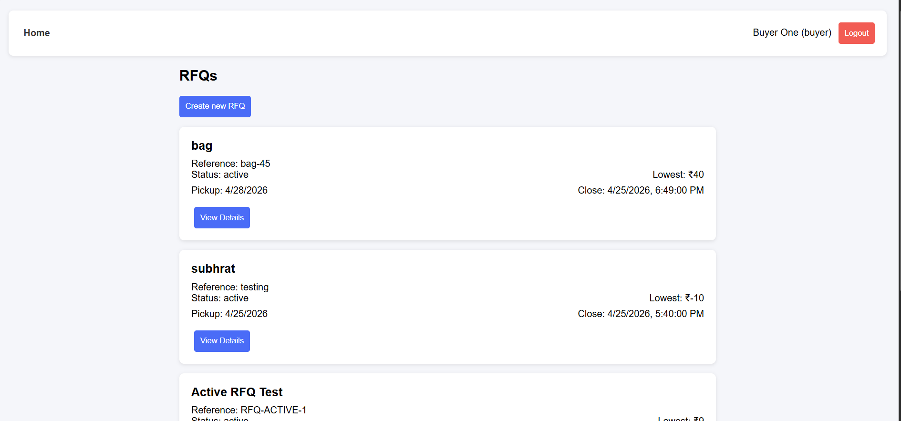
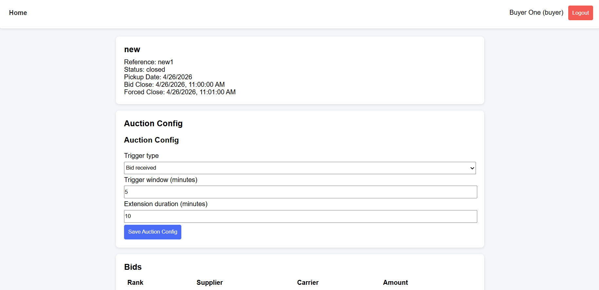
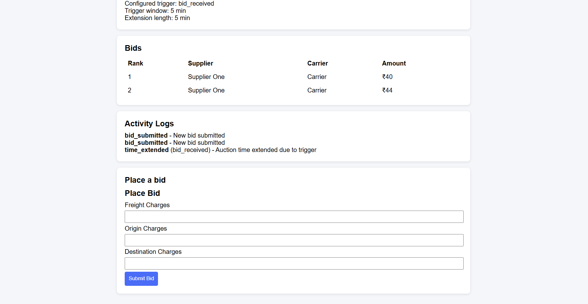
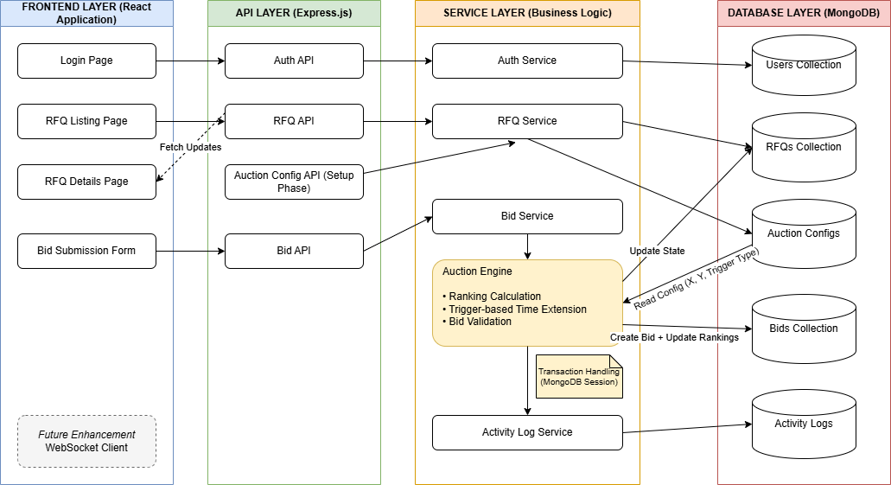
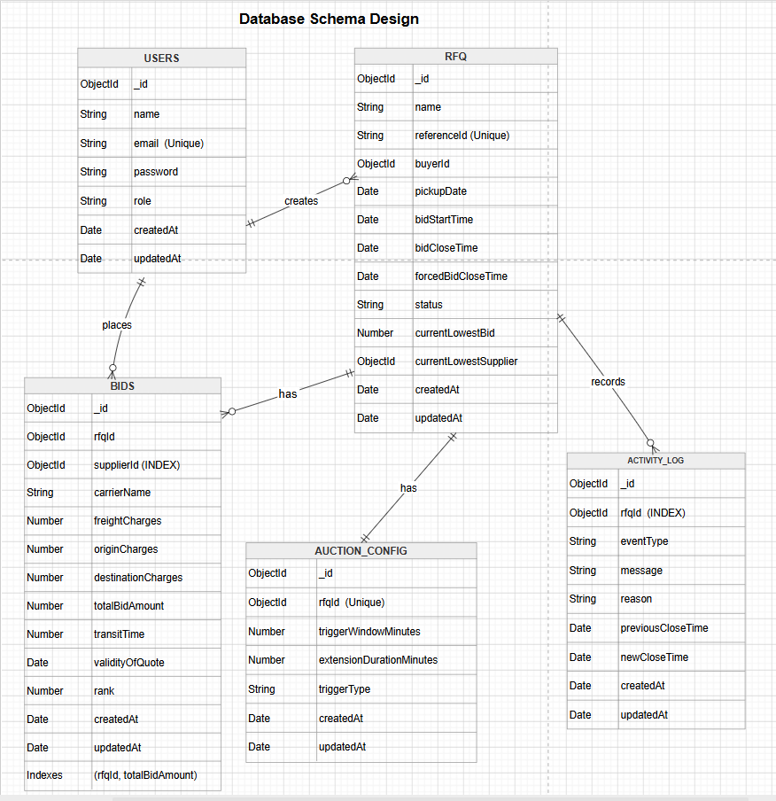

# 🚀 RFQ British Auction System

A full-stack web application that simulates a **British auction system for RFQs (Request for Quotation)** where suppliers competitively bid in real-time with **dynamic auction extension logic**.

---

## 📌 Features

* 🔐 Authentication (Buyer & Supplier roles)
* 📦 RFQ Creation (Buyer only)
* 🏷️ Supplier Bidding System
* 📊 Automatic Bid Ranking (L1, L2, ...)
* ⏱️ Auction Timer with Extension Rules
* 🔁 Trigger-based Auction Extension:

  * `bid_received`
  * `any_rank_change`
  * `l1_rank_change`

* 📝 Activity Logs (bid events, time extensions)
* 🌐 Structured and user-friendly frontend UI

---

### RFQ Listing Page


### RFQ Details Page


### Bidding Flow


---

## 🧠 Architecture Diagram

This diagram represents the layered architecture and flow of data from frontend to database through the auction engine.



## 🧠 System Design

```
Frontend (React)
        ↓
Backend API Layer (Express.js)
        ↓
Service Layer (Business Logic)
        ↓
Database (MongoDB)
```

---

## 🧠 Design Decisions

The system is built using a REST-based architecture to ensure consistency and reliability of auction operations. 
All state-changing actions such as bid submissions are handled through APIs with transactional guarantees.

Real-time updates (e.g., live bid changes) can be integrated using WebSockets, but were intentionally not implemented 
as they were outside the assignment scope. The system is designed in a way that such enhancements can be added easily.

---

## 📦 Database Schema


---

## ⚙️ Tech Stack

### Backend

* Node.js
* Express.js
* MongoDB + Mongoose
* JWT Authentication

### Frontend

* React (Vite)
* React Router
* Fetch API

---

## 📁 Project Structure

```
root/
 ├── backend/
 │     ├── src/
 │     │     ├── modules/
 │     │     ├── middlewares/
 │     │     ├── config/
 │     │     └── utils/
 │     ├── package.json
 │     └── server.js
 │
 ├── frontend/
 │     ├── src/
 │     │     ├── pages/
 │     │     ├── components/
 │     │     └── utils/
 │     ├── package.json
 │
 ├── .gitignore
 └── README.md
```

---

## 🚀 Setup Instructions

### 1️⃣ Clone Repository

```bash
git clone https://github.com/subhrat123/rfq-british-auction-system
cd rfq-british-auction-system
```

---

### 2️⃣ Backend Setup

```bash
cd backend
npm install
```

Create `.env` file:

```
PORT=5000
MONGO_URI=your_mongodb_uri
JWT_SECRET=your_secret_key
```

Run backend:

```bash
npm run dev
```

---

### 3️⃣ Frontend Setup

```bash
cd frontend
npm install
npm run dev
```

---

## 🔑 API Endpoints

### Auth

* `POST /api/v1/auth/signup`
* `POST /api/v1/auth/login`

### RFQ

* `POST /api/v1/rfqs`
* `GET /api/v1/rfqs`
* `GET /api/v1/rfqs/:id/details`

### Auction Config

* `POST /api/v1/auction-config`

### Bids

* `POST /api/v1/bids`

### Activity Logs

* `GET /api/v1/activity/:rfqId`

---

## 🔄 Auction Flow

1. Buyer creates RFQ
2. Buyer configures auction rules (trigger window & extension)
3. Suppliers place bids
4. System:

   * Calculates rankings
   * Detects trigger conditions
   * Extends auction time dynamically
5. Activity logs are recorded

---

## 🧪 Testing Flow

1. Signup/Login as Buyer
2. Create RFQ
3. Create Auction Config
4. Signup/Login as Supplier
5. Place bids
6. Observe:

   * Rank changes
   * Time extension
   * Activity logs

---

## ⚠️ Validations Implemented

* Role-based access control
* Non-negative bid values
* Bid must be lower than previous bid (per supplier)
* RFQ time validation (start < close < forced close)
* Single auction config per RFQ

---

## 💡 Key Highlights

* Transaction-based bid processing (ensures consistency)
* Dynamic ranking updates
* Trigger-based dynamic auction extension
* Clean modular backend architecture

---

## 📌 Future Improvements

* Live updates using WebSockets
* Countdown timers on frontend
* Better UI/UX enhancements
* Pagination & filtering

---

## 👨‍💻 Author

Subhrat Verma

---
